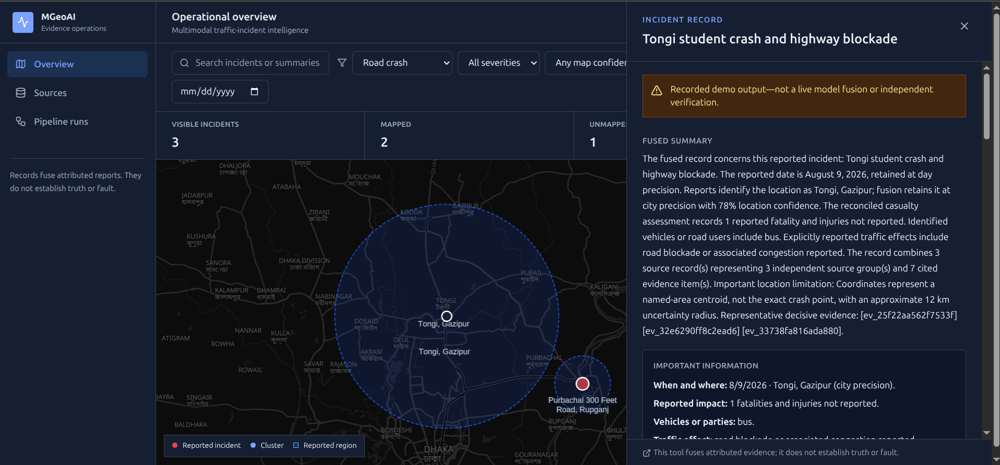

# MGeoAI

MGeoAI is a preliminary, provenance-preserving pipeline for turning
saved traffic-related news, social posts, and existing image/video analysis JSON
into reviewable incident records. It clusters reports about the same real-world
incident, retains conflicts and attribution, estimates location at defensible
precision, aggregates aspect-based sentiment, and serves JSON, GeoJSON,
Markdown, and a map-first operations dashboard.

The application fuses attributed evidence. It does **not** independently verify
that an incident occurred, determine fault, or establish that a claim is true.

## Dashboard preview



## Quick start

Requirements: Python 3.11+, Node 20+, and npm.

New to the project? Follow the complete [beginner setup tutorial](TUTORIAL.md)
for environment configuration, offline and live runs, reviewer accounts, source
submission, testing, and troubleshooting.

For the cross-disciplinary study design, curation rules, uncertainty model,
evaluation plan, and ethical/legal boundaries, read the
[research methodology](METHODOLOGY.md). The canonical international-corpus
contract is documented in [docs/CORPUS.md](docs/CORPUS.md).

```bash
python -m venv .venv
source .venv/bin/activate
python -m pip install -e '.[dev]'
cd web && npm install && cd ..
mgeoai doctor --provider recorded
mgeoai run --input assets/scraps --provider recorded --output-dir outputs/demo
```

The recorded provider is deterministic, offline, costs nothing, and is labeled
as non-live in every incident. Start development servers in separate terminals:

```bash
mgeoai serve --data-dir outputs/demo --host 127.0.0.1 --port 8000
cd web && npm run dev
```

Open `http://127.0.0.1:5173`. API documentation is at
`http://127.0.0.1:8000/docs`.

For a production frontend build served by FastAPI:

```bash
cd web && npm run build && cd ..
mgeoai serve --data-dir outputs/demo --host 0.0.0.0 --port 8000
```

Open `http://127.0.0.1:8000`.

### Serve the bundled v0.2.3 live dataset

Release v0.2.3 includes the production frontend and a validated DeepSeek Flash
thinking-mode output, so hosting does not require Node, a provider key, or data
regeneration. Install the Python package and run:

```bash
mgeoai serve \
  --data-dir outputs/deepseek-refusion \
  --host 0.0.0.0 \
  --port 8000
```

The bundled output contains the API records, GeoJSON, source/evidence views,
per-incident reports, and provider-run metadata required by the dashboard.
Transient provider-response caches and cost ledgers are intentionally excluded.

## Live DeepSeek run

Copy `.env.example` to an ignored `.env` or export values from a secret manager.
The CLI intentionally does not auto-load arbitrary `.env` files; activate them
in your shell or deployment system.

```bash
export FUSION_PROVIDER=deepseek
export DEEPSEEK_API_KEY='...'
export DEEPSEEK_MODEL='deepseek-v4-pro'
export DEEPSEEK_API_MODE=chat_completions
export DEEPSEEK_THINKING=enabled
export DEEPSEEK_INPUT_COST_PER_MILLION_USD='current-provider-price'
export DEEPSEEK_OUTPUT_COST_PER_MILLION_USD='current-provider-price'
mgeoai doctor --provider deepseek
mgeoai smoke-live --data-dir outputs/demo --output-dir outputs/live-smoke
mgeoai run --input assets/scraps --provider deepseek --output-dir outputs/live-demo
```

The model is not hard-coded. Check the current provider documentation and choose
an available JSON-output-capable model. In `auto`, the adapter currently chooses
the broadly supported Chat Completions JSON mode. `responses` explicitly requests
JSON Schema output. A failed live call produces a failed/retryable cluster; it
never activates recorded or deterministic fusion silently.

The adapter caps timeouts, retries, concurrency configuration, and output tokens.
It records endpoint mode, prompt/schema/provider/request hashes, latency, usage,
retry and validation state. Successful calls are cached using canonical evidence,
prompt, schema, provider, mode, and model. Credentials are never included in
requests logs, outputs, API data, or the browser.

## Runtime source submission and review

The dashboard includes a public **Submit source** form and an authenticated
**Review queue**. Runtime intake accepts the same two source shapes as the
supplied scraps:

- an HTML scrap ZIP containing exactly one UTF-8 `.html` page, with optional
  `SOURCE_INFO.md` and `image_01.json` in the same folder; or
- one UTF-8 video-analysis `.json` object matching the files under
  `assets/scraps/youtube`.

Raw images and raw video are not accepted; image information accompanies HTML
as `image_01.json`. Uploads and extracted ZIP contents are capped at 25 MB.
Packages are quarantined under `outputs/<run>/moderation/uploads/`. Reviewers can
inspect each HTML, metadata, and analysis file as inert text, verify hashes and
the file manifest, download the original package, and review its audit history
before rejection or approval. Approval copies the package into
`outputs/<run>/runtime_scraps/`, combines it with the configured base scraps,
and reruns the pipeline with the configured provider. Submitted HTML is parsed
as untrusted data and is never executed or sent raw to the fusion model.

The multipart submission fields are `submission_type` (`html_bundle` or
`video_json`), `package`, and optional `submitter_name`.

Configure any number of reviewers with PBKDF2 password hashes. Generate each
hash interactively, then provide a JSON username-to-hash mapping and a random
session-signing secret of at least 32 characters:

```bash
mgeoai hash-reviewer-password
export MGEOAI_REVIEWERS_JSON='{"alice":"pbkdf2_sha256$...","bob":"pbkdf2_sha256$..."}'
export MGEOAI_SESSION_SECRET='replace-with-a-random-secret-at-least-32-characters'
export MGEOAI_DATA_DIR='outputs/demo'
export MGEOAI_BASE_SCRAPS_DIR='assets/scraps'
mgeoai serve --data-dir outputs/demo
```

Set `MGEOAI_SECURE_COOKIES=true` when serving over HTTPS. Reviewer sessions use
an eight-hour, HTTP-only, SameSite cookie and mutating actions also require a
CSRF token. In an internet-facing deployment, terminate TLS and apply request
size/rate limits at the reverse proxy. Reviewer passwords and the signing secret
belong in a secret manager, not in the repository or generated data.

Approval is queued in-process and returns immediately with `processing`; the
review page polls until the pipeline finishes, avoiding reverse-proxy timeouts
during long live runs. A live provider failure stays visible as an
`ingest_failed` submission that can be retried; MGeoAI never silently changes to
the recorded provider. Keep the single server process running while an approval
is processing.

## Commands

```bash
mgeoai doctor --provider recorded
mgeoai hash-reviewer-password
mgeoai ingest assets/scraps --output outputs/demo/manifest.jsonl
mgeoai export-schemas --output-dir schemas
mgeoai run --input assets/scraps --provider recorded --output-dir outputs/demo
mgeoai evaluate --data-dir outputs/demo --output outputs/demo/evaluation.json
mgeoai run --input assets/scraps --provider deepseek --output-dir outputs/live-demo
mgeoai smoke-live --data-dir outputs/demo --output-dir outputs/live-smoke
mgeoai serve --data-dir outputs/demo
mgeoai corpus-validate --corpus-dir corpus/global-v1
mgeoai corpus-materialize --corpus-dir corpus/global-v1 --output-dir build/global-scraps
```

`run` is the end-to-end command: discovery, HTML conversion, modality adapters,
normalization, incident splitting, candidate matching, provider adjudication,
constraint-aware clustering, provider fusion, provenance validation, geolocation,
sentiment, and reporting.

## Inputs and outputs

Supported inputs are local saved HTML, `SOURCE_INFO.md` metadata next to HTML,
the supplied video/general analysis JSON, and the supplied image-analysis JSON.
The international-corpus layer adds bounded GDELT discovery and robots-aware
HTML capture helpers. Discovery is metadata-only until a source passes the
corpus review contract; blocked, authenticated, paywalled, or unsupported pages
are skipped and recorded. Raw media inference and unauthorized social-platform
scraping are not implemented.

## International corpus and visualization

`corpus/global-v1` is the canonical validated metadata/excerpt seed corpus. It keeps
the publisher URL for every source, SHA-256 hashes each committed payload,
records access/review decisions, and separates curation-only multi-source labels
from model input. The current snapshot contains 51 collection-country groups, 510
sources, and 53 automated distinct-domain multi-source candidates. These are
automated screening results, not human confirmation of incident truth, event country,
or upstream editorial independence. To check quotas and reproduce the pipeline input:

```bash
mgeoai corpus-validate --corpus-dir corpus/global-v1
mgeoai corpus-materialize \
  --corpus-dir corpus/global-v1 \
  --output-dir build/global-scraps
mgeoai run \
  --input build/global-scraps \
  --provider recorded \
  --output-dir outputs/global-v1
cp corpus/global-v1/reports/coverage.geojson outputs/global-v1/coverage.geojson
mgeoai serve --data-dir outputs/global-v1 --host 127.0.0.1 --port 8000
```

The dashboard's **Global coverage** view displays source counts at conservative
country centroids. Those markers are collection-country coverage symbols and are
explicitly not incident coordinates. The **Overview** map continues to use only
source-grounded incident geolocation. Direct links, article titles, discovery links,
and pair keys for manual checking are in
`corpus/global-v1/reports/source_links.csv`, and the country/quota table is in
`corpus/global-v1/reports/countries.md`.

Best-effort social discovery is retained separately under
`work/global_candidates/group_social/`. It contains public Bluesky AppView metadata
for eight countries, stores no media or full thread capture, and is excluded from the
accepted corpus until a human verifies event location, authorship, and source
independence.

Generated data is ignored under `outputs/<run>/`:

```text
manifest.jsonl                 discovered artifacts and hashes
sources/<source_id>/content.md clean model-readable Markdown
sources/<source_id>/blocks.json reversible block/provenance sidecar
sources.jsonl                  canonical source records
evidence.jsonl                 normalized evidence items
mentions.jsonl                 incident-level mentions (one source may have many)
sentiment.jsonl                holder/target/aspect sentiment evidence
matches.json                   features and provider adjudications
clusters.json                  accepted incident clusters
incidents/<id>/incident.json   canonical validated incident
incidents/<id>/report.md       deterministic human-readable report
incidents.json                 API collection
incidents.geojson              WGS84 [longitude, latitude] mapped collection
provider_runs.json             operational metadata without hidden reasoning
failed_clusters.json           terminal failures retained for retry/review
run.json                       batch summary and recorded/live mode
cache/                         successful request cache
moderation/submissions/        pending/reviewed submissions and audit history
moderation/uploads/            quarantined original packages and inspected files
runtime_scraps/                approved HTML/image-analysis/video-analysis scraps
```

Versioned JSON Schemas are exported to `schemas/`.

## Configuration

Checked-in defaults live in `configs/default.toml`; environment values override
provider secrets and deployment-specific settings. The major controls are
documented in `.env.example`: endpoint, model, API mode, timeout, retry count,
concurrency, token budget, and cost guardrails. Manual must-link/cannot-link pairs
can be placed in the TOML `[overrides]` section.

The local Bangladesh gazetteer stores representative area/city centroids for the
demo corpus. Its coordinates never claim rooftop precision. Unmapped incidents
remain available in the dashboard list.

## API and dashboard

The FastAPI service provides:

- `GET /api/incidents` with bbox, date, type, severity, confidence, source-count,
  sentiment, search, and pagination filters;
- `GET /api/incidents/{incident_id}`;
- `GET /api/incidents/{incident_id}/evidence` with full cited claims and provenance;
- `GET /api/incidents.geojson` with server-side spatial/filter handling;
- `GET /api/coverage.geojson` with explicitly non-incident country coverage markers;
- `GET /api/sources` and `GET /api/sources/{source_id}` with safe extracted
  content, plus `GET /api/runs` and `GET /api/health`;
- multipart `POST /api/submissions` and
  `GET /api/submissions/{submission_id}/status` for public runtime package
  intake and status receipts;
- `POST /api/reviewer/login`, `GET /api/reviewer/me`, and reviewer-only queue,
  inert file preview, original-package download, logout, approval, rejection,
  retry, and audit endpoints under `/api/reviewer`.

The React interface starts on a world map and includes marker clustering,
map/list synchronization, URL-preserved filters and selected incident, location
precision and named uncertainty regions, labeled roads and administrative
boundaries, informative fused summaries, a detailed fact/conflict/source review,
inspectable evidence and source content, unmapped records, source and run tables,
loading/error/empty states, a system/light/dark theme selector, and a small-screen
map/list toggle. Override the light map with
`VITE_MAP_STYLE_LIGHT_URL` (or the legacy `VITE_MAP_STYLE_URL`) and the dark map
with `VITE_MAP_STYLE_DARK_URL`; selected styles must provide their required
attribution.

## Development and verification

```bash
pytest
ruff check .
mypy src/traffic_fusion
cd web
npm test
npm run lint
npm run build
```

Tests use the recorded provider and mocked network responses. They must not make
live paid calls. Use a short, explicitly configured smoke run for DeepSeek.

## Extension points

To add a modality, implement an adapter that maps the new extraction contract to
`EvidenceItem`, preserving unknown fields and a source locator. Then register the
artifact in discovery and add sample-derived fixtures.

To add a provider (including the planned OpenAI provider), implement the small
`FusionProvider` protocol: `adjudicate`, `fuse`, `runs`, `name`, and `model`.
Canonical models, orchestration, CLI, reports, and API do not need to change.

## Matching and confidence design

Candidate matching is intentionally transparent. The deterministic score weighs
time (30%), normalized location (35%), named entities (15%), vehicles (5%), and
distinctive lexical overlap (15%). Generic crash terms are excluded. Specific
date/location conflicts become hard cannot-links before the provider is called;
distinctive shared anchors raise recall, while the provider still adjudicates the
bounded candidate. Cluster construction refuses a transitive merge that would
violate any cannot-link.

Recorded fusion confidence starts from direct normalized support, adds repeated
independent agreement, and subtracts conflicting alternatives; it is capped at
0.90. Live DeepSeek confidence is accepted only after schema, ID, quantity, and
provenance validation. Extraction confidence never changes an attributed
allegation into an observation.

## Current limitations

- HTML extraction is reproducible and provenance-preserving but heuristic; large
  site redesigns need publisher-specific selectors.
- The incident splitter uses transparent lexical/location anchors suited to the
  supplied Bangladesh corpus. Broader deployment needs learned extraction plus a
  larger evaluated gazetteer.
- No raw image/audio/video inference, live scraping, external geocoder, or
  multi-tenant retention service is included.
- The moderation queue and reviewer sessions use local files and process-local
  locking. Multi-instance deployment needs a shared database, distributed job
  queue, centralized rate limiting, and coordinated pipeline publication.
- The small evaluation corpus is a development fixture, not an accuracy claim.
- The production frontend is functional but MapLibre keeps the initial JavaScript
  bundle above Vite's 500 kB advisory threshold; route/map code splitting is a
  performance follow-up, not a build failure.
